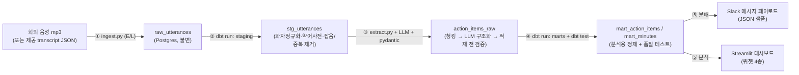

# 모비데이즈 AI Tech Lab 사전과제 — 기획안

**지원자: HA SEONGBONG (하성봉)**
회의 음성 → 회의록 자동 정리 → 액션아이템 자동 추출 → 분석 대시보드 PoC

> 코드가 본체이므로 본 기획안은 "왜 이렇게 설계했는가"의 의사결정 근거에 집중한다.

---

## 0. 의사결정 요약 (TL;DR)

| 영역 | 선택 | 한 줄 근거 |
|---|---|---|
| 언어 | Python | 필수 스택 |
| 저장소 | **Postgres (Docker Compose 단일 컨테이너)** | 도입 가정이 사내 100명 동시 사용 — 특히 액션아이템 진행상황 업데이트 시 동시 쓰기가 발생하므로, production OLTP 타깃과 PoC 저장소를 일치시켜 마이그레이션 리스크를 제거. `ON CONFLICT` upsert로 멱등성 확보 |
| 모델링 | **하이브리드 — 추출·적재(EL)는 Python, 변환(T)은 dbt-core** | dbt + Postgres는 표준 조합. `ref()` 자동 lineage·`schema.yml` 테스트로 적재 후 데이터 품질 검증을 선언적으로 확보. LLM 추출 같은 로직 단계는 dbt가 못 하므로 Python에 둠 |
| LLM | **Mock + 실제 호출 토글** | 기본은 고정 Mock 출력으로 재현성·멱등성 보장, 어댑터 교체로 실제 무료 API(Gemini) 호출 PoC까지 커버 |
| STT | 제공 transcript JSON 사용 (어댑터로 Whisper 확장) | 외부 유출 금지 + 시간 제약. STT를 `Transcriber` 인터페이스로 추상화해 로컬 Whisper 교체 가능 |
| 대시보드 | Streamlit | 과제 권장, Python 단일 스택 유지 |

설계 원칙 3가지: **① 신뢰할 수 없는 LLM 출력을 신뢰 가능한 데이터 자산으로 만든다(스키마 강제·검증·재시도·confidence). ② 모든 단계가 재실행에 안전하다(멱등성). ③ 원천 데이터는 경계 밖으로 나가지 않는다(외부 유출 금지).**

운영 원칙: 추출·적재(EL)는 Python, 변환(T)은 dbt로 **도구별 책임을 분리**하고, 검증은 **적재 전(pydantic 스키마 강제) + 적재 후(dbt test 데이터 품질) 2단**으로 둔다.

---

## 1. 문제 재정의

### 1.1 우선 해결할 페인포인트

배경에서 두 가지 부담이 제시된다 — (A) 회의 후 회의록·액션아이템 **수기 정리에 30~60분 소요**, (B) 한국어 회의 특성상 **결정이 흐릿하게 끝나거나 R&R이 암묵적으로 처리되어 액션아이템 누락이 잦음**.

본 PoC는 **(B) 액션아이템 누락을 1순위, (A) 정리 시간을 2순위**로 둔다. 근거는:

- **(A)는 비용 문제, (B)는 리스크 문제다.** 정리 시간은 누적 인건비이지만, 누락된 액션아이템은 광고주 대상 캠페인 일정·집행 차질로 직결돼 회사 신뢰와 매출에 영향을 준다. 단순 시간 단축 도구는 많지만, "흐릿하게 끝난 결정과 암묵적 R&R을 구조화"하는 것이 모비데이즈 회의 도메인의 진짜 난제다.
- **(B)를 풀면 (A)는 자동으로 따라온다.** 액션아이템을 신뢰 가능한 구조로 추출하면 회의록 정리도 그 결과물의 부산물로 자동화된다.

### 1.2 따라서 PoC가 증명해야 할 명제

> "잡음이 섞인 한국어 회의 발화에서, **누락 없이·근거를 달아·검증 가능한 형태로** 액션아이템을 구조화할 수 있다."

이 명제 때문에 단순 LLM 호출이 아니라 **스키마 강제 + confidence + 소스 발화 인용 + 검증/재시도**가 시스템의 핵심이 된다.

---

## 2. 시스템 아키텍처

### 2.1 End-to-End 흐름

수집(Python) → 변환(dbt staging) → AI 추출(Python+LLM) → 변환·테스트(dbt marts) → 분배·분석의 흐름이며, 각 단계는 독립 실행·재실행 가능한 멱등 모듈로 분리한다. **EL/T 책임 분리**가 다이어그램에 드러난다 — Python이 ①③(추출·적재 + LLM 로직), dbt가 ②④(SQL 변환 + 테스트)를 담당한다. `make run`이 `ingest.py → dbt run(staging) → extract.py → dbt run(marts) → dbt test`를 순차 실행하고, `make dashboard`가 ⑤를 띄운다.

### 2.2 단계별 도구·모델 선택과 trade-off

| 단계 | 선택 | 대안 | trade-off / 선택 이유 |
|---|---|---|---|
| STT | 제공 transcript JSON (인터페이스 뒤에 Whisper 확장) | 로컬 Whisper 직접 처리 | Whisper는 가산점이나 5분 음성 1건에 모델 다운로드·추론 시간 큼. STT를 `Transcriber` 인터페이스로 추상화해 핵심 로직과 분리 → 추후 교체 비용 0 |
| 저장소 | Postgres (Docker Compose) | DuckDB / SQLite | 도입 가정 100명 동시 사용 — 진행상황 업데이트 시 동시 쓰기가 생기므로 단일 writer인 DuckDB·SQLite는 production 부적합. PoC 데이터는 작아 성능차는 무의미하나 **동시성 모델 + 타깃 일치**가 결정 요인. Docker Compose 단일 컨테이너로 셋업 |
| 모델링 | 하이브리드 (Python EL + dbt T) | 순수 SQL / dbt 전체 | 추출(LLM)은 dbt가 못 하므로 Python, 집계 변환은 dbt가 lineage·테스트까지 제공. 순수 SQL은 셋업 0이나 테스트·문서를 직접 구현해야 함. dbt 전체는 LLM 단계를 못 담아 부적합 |
| LLM | Mock + 실제호출 토글 (`LLM_MODE` env) | 실제 호출 전용 | 실제 호출만 쓰면 재현성·비용·레이트리밋 리스크. Mock 고정 출력을 기본값으로 두어 멱등 보장, 실제 호출은 옵션으로 검증 |
| 구조화 | function calling / structured output + pydantic 검증 | 자유 텍스트 파싱 | 정규식 파싱은 환각·포맷 붕괴에 취약. JSON 스키마 강제 + pydantic 재검증 + 실패 시 재시도로 신뢰성 확보 |
| 대시보드 | Streamlit | Metabase / Superset | BI 툴은 별도 서버·셋업 필요. Streamlit은 Python 단일 스택, 코드로 위젯·드릴다운 자유 구성 |

---

## 3. 데이터 스키마 설계 근거

### 3.1 레이어 구조 (raw → staging → extract → mart)

| 레이어 | 테이블 | 담당 | 역할 | 정규화 방침 |
|---|---|---|---|---|
| raw | `raw_utterances` | Python (ingest) | 원천 transcript 무가공 적재 (불변) | 원본 보존 위해 가공 금지. 재처리 시 진실의 원천 |
| staging | `stg_utterances` | **dbt** | 화자 정규화·약어 사전 적용·잡음/중복 발화 제거 | 정규화(3NF 지향) — 화자·발화를 분리해 재사용성 확보 |
| extract | `action_items_raw` | Python (LLM + pydantic) | 의미단위 청킹 → LLM 구조화 추출 → **적재 전 검증** | LLM 출력 + confidence·근거 발화 동봉 |
| mart | `mart_action_items`, `mart_minutes` | **dbt (+ dbt test)** | 분석·분배용 최종 산출 + 데이터 품질 테스트 | **의도적 비정규화** — 대시보드·Slack이 조인 없이 읽도록 회의 메타 동봉 |

**정규화/비정규화 결정 근거:** staging까지는 정규화해 중복을 없애고 변환 로직을 단순화한다. 그러나 mart는 "의사결정자가 한 화면에서 본다"는 목적상 읽기 성능이 우선이므로, 회의 제목·날짜·광고주 등 자주 함께 조회되는 컬럼을 액션아이템 행에 비정규화로 동봉한다(읽기 최적화 vs 쓰기 중복의 trade-off에서 읽기를 택함).

**2단 검증 구조:** 이 과제 검증의 핵심은 두 지점에 나뉜다. ① **적재 전** — LLM 출력을 `action_items_raw`에 넣기 전에 pydantic으로 스키마를 강제하고 위반 시 재시도(환각·포맷 붕괴 차단). ② **적재 후** — dbt `schema.yml` 테스트로 `mart_action_items`의 데이터 품질을 선언적으로 검증(`confidence` 0~1 범위, `action_item_id` unique, `meeting_id` not_null 등). 둘은 대체가 아니라 보완이다.

### 3.2 핵심 테이블 — `mart_action_items` 필드 정의

| 필드 | 타입 | 정의 근거 |
|---|---|---|
| `action_item_id` | TEXT (해시) | 멱등성 키. `meeting_id + 정규화 내용`의 해시로 생성 → 재실행 시 중복 적재 방지 |
| `meeting_id` | TEXT | 회의 식별자 (비정규화 조인키) |
| `content` | TEXT | 액션아이템 본문 (LLM 추출) |
| `assignee` | TEXT \| NULL | 담당자. 암묵적 R&R("그건 제가 챙길게요") → 화자 매핑. **불명확 시 NULL 허용** |
| `due_date` | DATE \| NULL | 기한. 명시 없으면 NULL + `due_is_inferred` 플래그 |
| `status` | ENUM(open/done/blocked) | 진행상황. 기본 open |
| `confidence` | FLOAT (0~1) | **LLM 추출 신뢰도**. 낮은 항목은 대시보드에서 검수 대상으로 드릴다운 |
| `source_utterance_id` | TEXT | **근거 발화 인용**. 추출이 어느 발화에서 나왔는지 역추적 → 환각 검증의 핵심 |
| `source_quote` | TEXT | 근거 발화 원문 스니펫 |
| `is_ambiguous` | BOOL | "결정이 흐릿하게 끝난" 케이스 표시 → 누락 대신 플래그로 보존 |
| `extracted_at` | TIMESTAMP | 추출 시각 |

**설계 핵심:** `confidence` + `source_utterance_id` + `is_ambiguous` 3개 필드가 "신뢰할 수 없는 LLM 출력을 신뢰 가능한 자산으로" 만드는 장치다. 흐릿한 결정도 버리지 않고 `is_ambiguous=true`로 보존해 **누락(1순위 페인포인트)을 구조적으로 방지**한다.

---

## 4. Before / After 임팩트 추정 (사내 100명 기준)

> 모든 수치는 **가정값 → 산출** 구조다. 실제 도입 시 1~2주 baseline 측정으로 보정 권장.

### 4.1 가정값

| 가정 | 값 | 근거 |
|---|---|---|
| 회의록을 직접 정리하는 실무자 | 100명 중 40명 | 캠페인 운영 담당자 비율 가정 |
| 1인당 주당 캠페인 회의 | 2건 | 광고주별 주간 회의 운영(배경) |
| 주당 총 회의 | 80건 | 40명 × 2건 |
| 회의당 수기 정리 시간 (Before) | 45분 | 명세 제시 "30~60분"의 중앙값 |
| 회의당 검수 시간 (After) | 10분 | 자동 초안 검수·수정만 수행 |
| 액션아이템 누락률 (Before) | 20% | 암묵적 R&R·흐릿한 결정 가정 |
| 액션아이템 누락률 (After) | 5% 이하 | confidence·is_ambiguous 플래그 검수로 회수 |

### 4.2 산출

| 지표 | Before | After | 개선 |
|---|---|---|---|
| **시간** (주당, 전사) | 80건 × 45분 = **60시간/주** | 80건 × 10분 = **13.3시간/주** | **약 46.7시간/주 절감 (≈78%)** |
| **시간** (연환산) | 약 3,120시간/년 | 약 693시간/년 | 약 2,427시간/년 |
| **품질** | 검증 근거 없음 | 발화 인용 + confidence로 추적 가능 | 정성 — 검수 가능성 확보 |
| **누락률** | 20% | 5% 이하 | **누락 약 75% 감소** |

**해석:** 단순 시간 절감(78%)도 크지만, 본 PoC의 진짜 가치는 **누락률 20% → 5%**다. 흐릿한 결정을 폐기하지 않고 플래그로 보존·검수하게 만든 결과이며, 이것이 1.1에서 1순위로 둔 페인포인트의 직접 해결이다.

---

## 5. 실패 시나리오 & 대응

### 시나리오 1 — LLM이 스키마를 위반하거나 환각한다
회의에 없던 담당자·기한을 지어내거나, JSON 구조가 깨진다.
**대응:** ① structured output / function calling으로 출력 스키마 강제 → ② pydantic으로 적재 전 2차 검증 → ③ 위반 시 에러 메시지를 담아 **최대 N회 재시도** → ④ 그래도 실패하면 해당 항목을 `confidence=0` + 검수 큐로 보냄(버리지 않음). 모든 추출은 `source_utterance_id`로 원본 발화와 대조해 환각을 사후 검증하며, 적재 후엔 **dbt test가 데이터 품질 이상(범위·null·중복)을 한 번 더 걸러낸다.**

### 시나리오 2 — 화자 분리·R&R 매핑 오류
"그건 제가 챙길게요"의 화자가 잘못 매핑되거나, 책임자 없이 흘러간 액션의 담당자를 강제 지정한다.
**대응:** 담당자 불명확 시 **강제 지정 금지, `assignee=NULL` + `is_ambiguous=true`** 로 보존. 대시보드 위젯 ②(담당자별 미완료)와 ④(낮은 confidence 드릴다운)에서 사람이 최종 확정. **잘못된 자동 매핑보다 명시적 미정이 안전하다**는 원칙.

### 시나리오 3 — 파이프라인 재실행 시 중복 적재
같은 회의를 두 번 처리해 액션아이템이 중복으로 쌓인다.
**대응:** `action_item_id`를 `meeting_id + 정규화 내용` 해시로 생성하고 적재를 Postgres **`INSERT ... ON CONFLICT (action_item_id) DO UPDATE`(upsert)** 로 구현 → 재실행해도 동일 결과(멱등성). raw 레이어는 불변 보존이라 언제든 동일 입력으로 전체 재현 가능.

---

*(작업용 1차 초안 — 데이터 수령 후 3.2 필드 및 4.1 가정값 보정 예정)*
